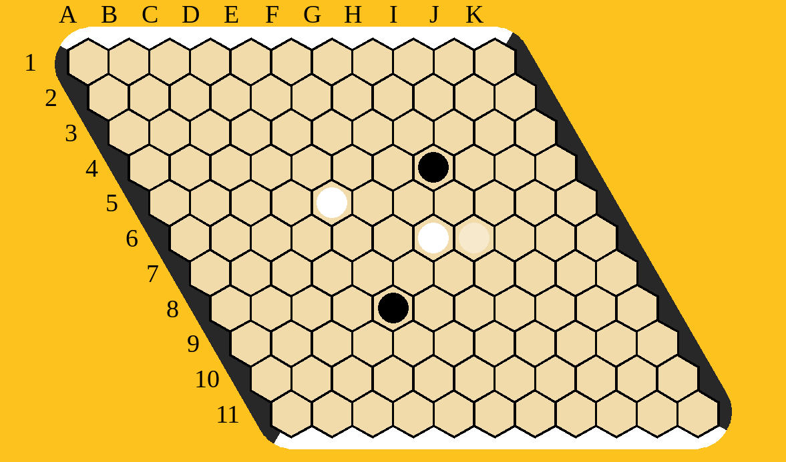

# Hex Game AI

A modern implementation of the Hex game using AlphaZero-inspired reinforcement learning strategies. The project combines Monte Carlo Tree Search (MCTS) with deep neural networks implemented in PyTorch, featuring a sleek GUI for gameplay.



## ✨ Features

- **Advanced AI**: Uses MCTS combined with a Policy-Value Neural Network.
- **Training Pipeline**: Iterative training process to improve the AI's performance.
- **Interactive GUI**: Built with Pygame for a smooth user experience.
- **Modern Tooling**: Managed with `uv` for fast and reliable dependency management.
- **Quality Code**: Linted with `ruff` and type-checked with `mypy`.

## 🛠 Prerequisites

- **Python**: 3.12 or higher.
- **uv**: A fast Python package installer and resolver. [Install uv](https://github.com/astral-sh/uv).

## 🚀 Getting Started

### Installation

Clone the repository and install dependencies:

```bash
git clone https://github.com/your-username/hex_game.git
cd hex_game
uv sync
```

### Playing

To play against the current model:

```bash
make play
# OR
uv run hex-play
```

### Training

To start the training pipeline:

```bash
make train
# OR
uv run hex-train
```

## 🛠 Development

The project includes a `Makefile` for common development tasks:

- **Run Tests**: `make test`
- **Lint Code**: `make lint`
- **Type Check**: `make mypy`
- **Full Check**: `make check` (runs lint, mypy, and tests)

## 📁 Project Structure

- `src/hex_game/ai/`: AI implementation (MCTS, Model, Training).
- `src/hex_game/game/`: Core game logic (Board).
- `src/hex_game/ui/`: Graphical user interface (Pygame).
- `tests/`: Automated tests.
- `models/`: Stored model checkpoints.
- `data/`: Generated gameplay data for training.


